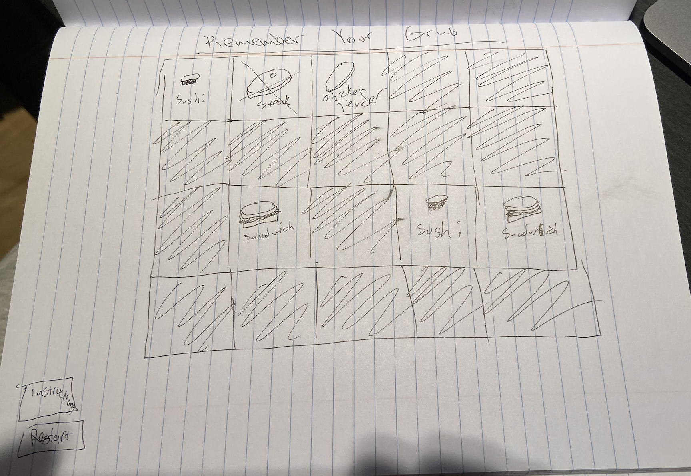

# __Remember Your Grub__
https://j-onederful.github.io/remember-my-grub/
 ---
 ### What's happenin
 ---
 In this game the player must rely on their memory to match which up two of the same types of food in a 20 box grid. In order to succeed, player must match all of the food. Click on exposed image for a cheatsheet 😉.

 

 ### MVP
 ---
 * Create a grid screen with twenty boxes
 * Render instructions button, start button and new game button
 * Link pictures that appear once button on top is clicked
 * Once matched pair is clicked, leave those two images visible on grid

 ### Stretch Goals
 ---
 * Make randomizer that throws in more types of food
 * Upon pressing of start button, have grid show you locations of foods for 1 second before hiding again
 * Use 'if' statement (?) to denote how many times wrong answers are clicked (three times and game over)
 * Have countdown clock running down from a minute once images are hidden after start button pressed

